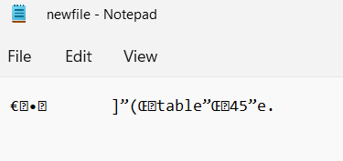
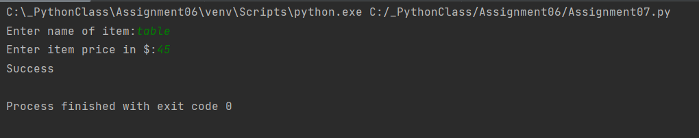

# Exception handling and Pickling in Python
*SAbad, 05.30.2022

## Introduction
In this assignment I have listed down a few websites(resources) that helped me learn concepts on Exception handling and Pickling in Python.

### Exception handling

The resources for Exception handling are listed below-

https://www.tutorialsteacher.com/python/exception-handling-in-python

This website shows how to apply Exception handling in python. It shows some basic examples to catch basic error types such as division by zero. It then extends the concept to Multiple except blocks.  

https://www.w3schools.com/python/python_try_except.asp

This website shows simple examples on try, except, else and finally blocks. I learnt that you can define as many exception blocks as you want, e.g. if you want to execute a special block of code for a special kind of error. You can use the else keyword to define a block of code to be executed if no errors were raised. The finally block, if specified, will be executed regardless if the try block raises an error or not.

https://www.pythontutorial.net/python-oop/python-raise-exception/

This website shows how to raise an exception. As a Python developer you can choose to throw an exception if a condition occurs. To throw (or raise) an exception, use the raise keyword.

### Pickling

The resources for Pickling are listed below-

https://www.datacamp.com/tutorial/pickle-python-tutorial 

I found this website useful because it did a great job of explaining fundamentals associated with pickling in python. It started with description of pickling and how it is different from compression. It briefly explained how is pickling useful and where and when we should use pickling.  It provides a brief summary of various object types that can be pickled. It also provided some basic examples on how to pickle a dictionary using the dump () method. The unpickling files was demonstrated using the load () method.

https://realpython.com/python-pickle-module/

I found this website especially useful since it explained the difference between pickle, json and marshal. It also lists the protocols that Python pickle module can use. It also describes the difference between the 2 pickling methods- dump () and dumps ().The only difference between dump () and dumps () is that the first creates a file containing the serialization result, whereas the second returns a string. It also briefly covers risks associated with pickling.

https://towardsdatascience.com/do-not-use-python-pickle-unless-you-know-all-these-facts-d9e8695b7d43

This website goes into more detail on what are the pros and cons of pickling. It also describes objects that cannot be pickled.

I created a program that incorporates the basic concept of Pickling and Exception handling. The code and the output of the program is shown below.

```
# ------------------------------------------------- #
# Title: Exception handling and pickling
# Description: A simple example of Exception handling and pickling
# ChangeLog: (Who, When, What)
# Samir Abad,05.29.2022,Created Script
# ------------------------------------------------- #
import pickle  # This imports code from another code file!

# Data -------------------------------------------- #
# Declare variables and constants
fName = 'newfile.dat'
lstItemsPrice = []

def write_to_file(filename, list_of_items):
    file=open(filename,"wb")
    pickle.dump(list_of_items,file)
    file.close()


try:
    item = input("Enter name of item:")
    if not item.isalpha():
        raise Exception('Do not use numbers for the item name')
except Exception as e:
    print('There was a non-specific error!')
    print("Built-In Python error info: ")
    print(e, e.__doc__, type(e), sep='\n')
    exit()

else:
    try:
        price=input("Enter item price in $:")
        if not price.isnumeric:
            raise Exception('Use integer values to input the price!')
    except Exception as e:
        print('There was a non-specific error!')
        print("Built-In Python error info: ")
        print(e, e.__doc__, type(e), sep='\n')
        exit()

lstItemsPrice=[item,price]

write_to_file(fName,lstItemsPrice)
print("Success")
```



